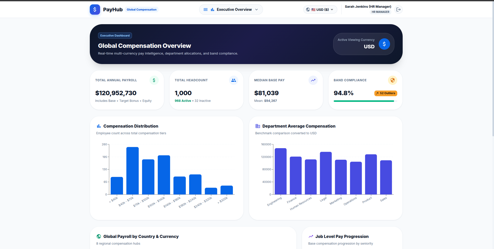
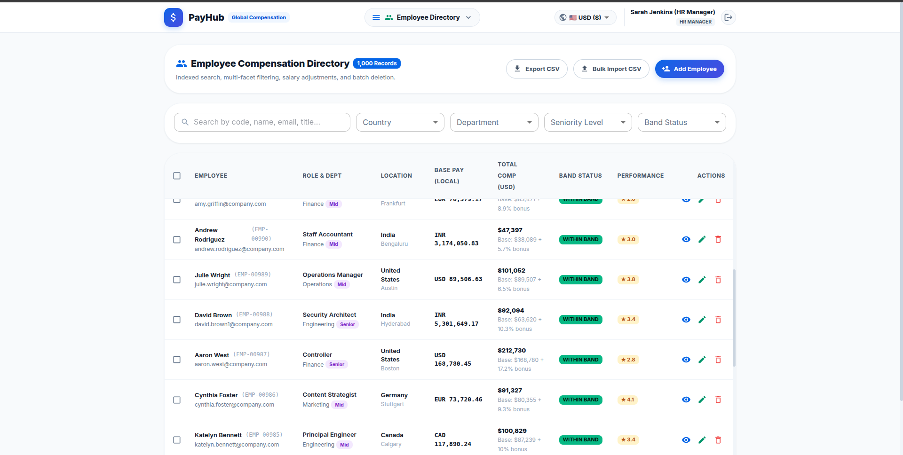
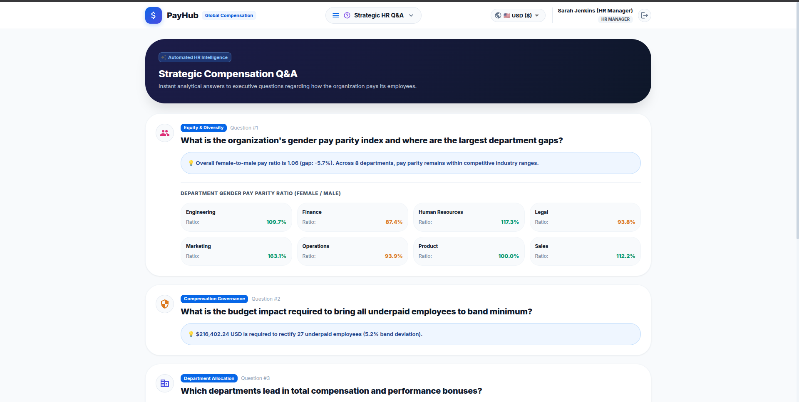
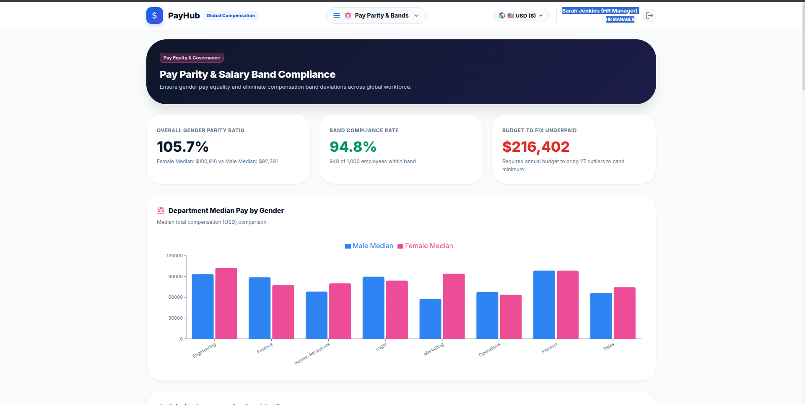

# 💰 Global Salary Management System

An enterprise-grade compensation intelligence and salary management platform built for **HR Leadership & Executives** to manage, analyze, govern, and adjust compensation data across **8 global countries and currencies** with sub-50ms query responsiveness.



---

## 🌟 Visual Feature Showcase

### 1. 📊 Executive Compensation Overview Dashboard
* **High-Level Payroll KPIs**: Instant visibility into Total Annual Payroll, Active Headcount, Median Base Pay, and Salary Band Compliance rate.
* **Interactive Pay Distribution**: Visual histogram mapping employee counts across total compensation tiers.
* **Department Benchmark Averages**: Cross-functional compensation comparison.
* **Multi-Currency Engine**: Live currency conversion across **USD ($), EUR (€), GBP (£), INR (₹), SGD (S$), CAD (CA$), AUD (A$), and JPY (¥)**.


---

### 2. 👥 Employee Compensation Directory & Governance
* **Sub-50ms Server-Side Paginated Grid**: Ultra-fast indexed search across employee code, name, email, and job title.
* **Single Employee Ingestion**: 1-Click **"Add Employee"** modal with personal info, country-specific salary currency handling, and live total USD compensation calculation.
* **Multi-Facet Filtering**: Filter by Country, Department, Seniority Level, and Band Status (`Within Band`, `Underpaid Outlier`, `Overpaid Outlier`).
* **Multi-Select & Bulk Operations**: Checkbox row selection with batch deletion and single-record deletion with confirmation dialogs.
* **CSV Data Pipelines**: Line-by-line validated CSV bulk upload and streaming export.



---

### 3. 💡 Strategic HR Q&A (Automated Compensation Intelligence)
* Instant pre-computed answers to core executive compensation inquiries:
  * *"What is the organization's gender pay parity index and where are the largest department gaps?"*
  * *"What is the budget impact required to bring all underpaid employees to band minimum?"*
  * *"Which departments lead in total compensation and performance bonuses?"*
  * *"Who are the top 5 highest compensated roles globally?"*



---

### 4. ⚖️ Pay Parity & Salary Band Compliance
* **Gender Pay Parity Ratios**: Department-by-department side-by-side female vs. male median compensation comparison.
* **Remediation Budget Engine**: Exact calculated capital required to eliminate all underpaid outliers.
* **Priority Band Outliers Table**: Fast 1-click **"Rectify"** triggers to apply salary corrections.



---

## 🚀 Quick Start Guide

You can run the entire platform (PostgreSQL Database + FastAPI Backend + React/Vite Material-UI Frontend) using either **Makefile commands**, **Native Docker Compose**, or **Local Development**.

---

### Option A: Using Makefile (Recommended)

The easiest and fastest way to manage the full lifecycle:

```bash
# 1. (Optional) Run one-time local dependency setup & database seeding
make setup-local

# 2. Build and launch all containerized services (Postgres + Backend + Frontend)
make up

# 3. (Optional) In another terminal, apply database migrations
make migrate
```

#### 🛠️ Available Makefile Commands:
| Command | Description |
| :--- | :--- |
| `make setup-local` | One-click setup: checks `.env`, installs Python & Node packages, and seeds initial data |
| `make up` | Builds and starts all services in the foreground with live logs |
| `make up-d` | Builds and starts all services in detached (background) mode |
| `make down` | Stops and removes running containers |
| `make down-v` | Stops containers and wipes the PostgreSQL data volume (fresh start) |
| `make logs` | Tails live logs across all containers (`make logs-backend`, `make logs-frontend`, `make logs-db`) |
| `make ps` | Displays status and port mappings of all running containers |
| `make restart` | Restarts all running containers |
| `make migrate` | Applies all pending Alembic database migrations (`alembic upgrade head`) |
| `make migrate-generate m="msg"` | Autogenerates a new Alembic schema migration revision |
| `make migrate-downgrade` | Rolls back the latest database migration |
| `make test` | Executes the full Pytest test suite inside the backend container |
| `make lint` | Runs code linters for both Backend (Ruff) and Frontend (ESLint) |
| `make format` | Automatically fixes code style violations and formats the codebase |
| `make clean` | Cleans temporary cache files, `.pytest_cache`, `.ruff_cache`, and `__pycache__` |

---

### Option B: Using Native Docker Compose Commands

If you prefer standard Docker Compose commands without `make`:

```bash
# 1. Build and start all services
docker compose up --build

# Or start in detached (background) mode
docker compose up -d --build

# 2. Run database migrations inside the backend container
docker compose exec backend alembic upgrade head

# 3. Run Pytest suite inside the backend container
docker compose exec backend pytest backend/

# 4. View container status
docker compose ps

# 5. Tail live logs
docker compose logs -f

# 6. Stop all services
docker compose down

# Stop and wipe database volume
docker compose down -v
```

---

### Option C: Local Development without Docker

For developers running Python and Node directly on their local machine:

```bash
# 1. Copy environment template
cp .env.example .env

# 2. Install backend dependencies
pip install -r backend/requirements.txt

# 3. Install frontend dependencies
cd frontend && npm install && cd ..

# 4. Seed initial database records
python3 backend/scripts/seed_data.py

# 5. Start FastAPI backend (Port 8000)
uvicorn app.main:app --app-dir backend --host 127.0.0.1 --port 8000 --reload

# 6. In a separate terminal, start React/Vite frontend (Port 5173)
cd frontend && npm run dev
```

---

## 🌐 Application Access & Ports

| Service | URL / Port | Details |
| :--- | :--- | :--- |
| **Frontend Web App** | [http://localhost:5173](http://localhost:5173) | Responsive React 18 + Vite + Material-UI (MUI v5) interface |
| **Backend API & Swagger** | [http://localhost:8000/docs](http://localhost:8000/docs) | Interactive OpenAPI / Swagger API documentation |
| **Backend Healthcheck** | [http://localhost:8000/health](http://localhost:8000/health) | System health & status check endpoint |
| **PostgreSQL Database** | `localhost:5433` | PostgreSQL 16 (Mapped to host port `5433` to prevent port 5432 conflict) |

---

## 🔑 Demo Login Credentials

The database is pre-seeded with accounts for all key organizational roles. *(1-click demo login buttons are also available directly on the login screen)*:

| Role | Email | Password | Permissions |
| :--- | :--- | :--- | :--- |
| **HR Manager** (Default) | `hr.manager@company.com` | `Password123` | Full access: salary adjustments, bulk deletes, CSV import/export |
| **System Administrator** | `admin@company.com` | `Admin123!` | System configuration, user management, database governance |
| **Chief People Officer** | `executive@company.com` | `Exec123!` | Executive dashboard, strategic HR Q&A, pay parity insights |

> **Note on Registration**: When creating a new account via **"Create Account"**, the user is safely redirected back to the **Sign In** screen with a confirmation message to authenticate with their credentials.

---

## 🏗️ Architecture & Technology Stack

```
┌─────────────────────────────────────────────────────────────┐
│             React + Vite Material-UI (MUI v5)               │
│  (TypeScript, Emotion, MUI Joy/Core, Tailwind, Recharts)    │
└──────────────────────────────┬──────────────────────────────┘
                               │ (REST API / JWT Auth)
                               ▼
┌─────────────────────────────────────────────────────────────┐
│                    FastAPI Backend Gateway                  │
│   (Python 3.13, Pydantic v2, Repository Pattern, Alembic)   │
└──────────────────────────────┬──────────────────────────────┘
                               │ (SQLAlchemy 2.0 ORM)
                               ▼
┌─────────────────────────────────────────────────────────────┐
│                 PostgreSQL 16 Database                      │
│   (employees, salary_records, salary_audit_logs, users)     │
└─────────────────────────────────────────────────────────────┘
```

* **Frontend**: React 18, Vite, TypeScript, Material-UI (MUI v5), Emotion, Recharts SVG data visualizations, Tailwind CSS.
* **Backend**: FastAPI (Python 3.13), SQLAlchemy 2.0, Alembic, Pydantic v2, PBKDF2 Password Hashing, JWT Bearer Tokens.
* **Repository Pattern**: Strict isolation of database queries in [`backend/app/repositories/`](backend/app/repositories/) separate from business logic in [`backend/app/services/`](backend/app/services/).
* **Centralized Logging & Request Timing**: Centralized [`backend/app/core/logger.py`](backend/app/core/logger.py) with request latency middleware tracking millisecond execution duration via `X-Process-Time-Ms` response headers.
* **Responsive UI**: Adapts cleanly across Mobile (`<640px`), Tablets (`640-1024px`), Desktops (`1024-1440px`), and Ultra-Wide displays.

---

## 🧪 Testing & Code Quality

### Running Tests
Execute the deterministic backend Pytest test suite (24 tests covering Repositories, Auth, Salary Adjustments, Analytics, and CSV Import/Export):

```bash
# Inside Docker container:
make test

# Or locally:
pytest backend/
```

### Running Linters & Formatters
```bash
# Run both Backend Ruff and Frontend ESLint:
make lint

# Automatically format and fix violations:
make format
```

---

## 📁 Engineering Artifacts & Assessment Docs

* 📄 **Product Requirements Document (PRD)**: [`docs/REQUIREMENTS.md`](docs/REQUIREMENTS.md)
* 🏛️ **System Architecture & Data Flow**: [`docs/ARCHITECTURE.md`](docs/ARCHITECTURE.md)
* ⚖️ **Design Trade-offs & Rationale**: [`docs/TRADE_OFFS.md`](docs/TRADE_OFFS.md)
* ⚡ **Performance & Indexing Benchmarks**: [`docs/PERFORMANCE.md`](docs/PERFORMANCE.md)